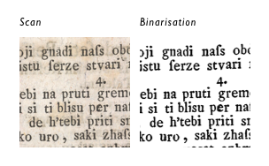

## Datensets
% Wie entstehen die Datensets
- manuell
Die manuelle Erstellung eines Datensatzes von annotierten Dokument ist ein er
- semimanuell 

## Komplexe Layout Segmentierung
simistira_diva-hisdb:_2016

## Dokumententen-Binarisierung

ioannis_pratikakis_dibco_2017

page segmentation problem